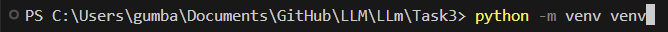
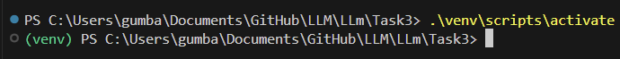
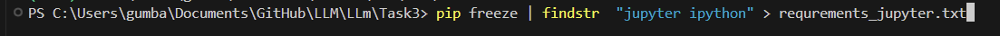

# LLM

## Инструкция для файла Task3

1. Для начала необходимо создать дерикторию где будет виртуальное окружение
2. Дальше открываем командную строку и пишем команду для создания виртуального окружения

    ```bash
    python -m venv venv
    ```
    

3. Для активации виртуального окружения вводим команду

    ```bash
    .\venv\scripts\activate
    ```
    

4. Следующим шагом устанавливаем пакеты для ML

    ```bash
    pip install numpy pandas scikit-learn seaborn plotly
    ```
    

5. После сохраняем названия бибилиотек, чтобы не таскать их с собой
    
    ```bash
    pip freeze | findstr "numpy pandas scikit-learn seaborn plotly" > requrenets_ML.txt
    ```
    

6. Аналогично проделываем с оставшимеся библиотеками

    ```bash
    pip install fastpapi uvicorn gradio
    
    pip freeze | findstr "fastapi uvicron gradio" > requrenets_service.txt

    pip install jupyter ipython
    
    pip freeze | findstr "jupyter ipython" > requrenets_jupyter.txt
    ```

    

    

    

    

7. Чтобы проверить содержащее в файлах можем использовать эту команду

    ```bash
    Get-Content requrenets_ML.txt

    Get-Content requrenets_service.txt

    Get-Content requrenets_jupyter.txt
    ```

8. Для установки библиотек из файла используем команду

    ```bash
    pip install -r requrenets_ML.txt

    pip install -r requrenets_service.txt

    pip install -r requrenets_jupyter.txt
    ```


